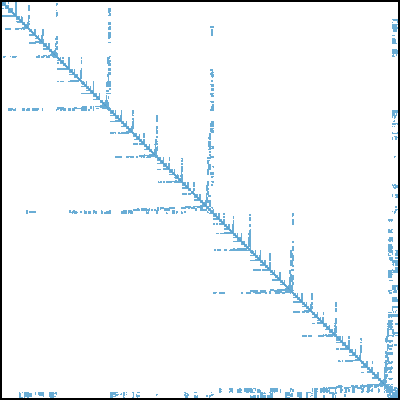
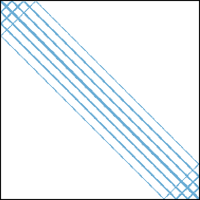

# marc

`marc` is a tool for visualizing sparse matrices in matrix market format.

For given sparse matrix, it produces an image that displays the density of non-zeroes. Each part of the matrix is colored and the higher the intensity of the color the more non-zeros in that particular region of the matrix there are. Here are some examples:




## How it works

Typically, sparse matrices are very large, so we can't just draw each element as one pixel since the resulting image would be gigantic. Instead, `marc` splits the matrix into square blocks and counts the number of non-zeros in each of them. This way we obtain a grid of blocks thats is much smaller and now each block can be drawn as a pixel with a color corresponding to the ratio between the number of non-zeros and its capacity.

## Image size considerations

One limitation of this tool is that the precise size of the image can't be guaranteed and the size specified on the command-line is considered as an upper-bound. Meaning the output image is as large as possible while still fitting into the specified area.

Additionally, the aspect ratio of the matrix is preserved only for square matrices. Rectangular matrices might be drawn with a slightly different aspect ratio.

The reason for both of these is that the size of blocks is a whole number and each is drawn as one pixel. So in most cases there is one block size which would result into an image that is too large but the block size one smaller would result into an image that is too small. To have the precise size we would need blocks with fractional size or draw blocks with subpixel precision.

As for the aspect ratio issue. The last block usually "sticks" of the matrix and for rectangular matrices it very likely sticks out by different amounts in each dimension which slightly distorts the aspect ratio.

## Colors

There are two ways colors can be assigned to blocks. One way is to map each possible occupation of a block to a color, with 0 meaning white and full block meaning the highest intensity. One issue with this is that blocks don't usually contain many non-zeros and their occupation is fairly low, which results into quite dim colors. Nevertheless this is the default setting.

The other option is to adjust the color range to only map to the actual occupation of the blocks. Meaning 0 is still white but now the highest intensity is assigned to the maximum occupation in all of the blocks. This can be turned on using the `--adjust-colors` options.

## Building

There are no dependencies, the only requirement is a c++17 compiler and *cmake*.

`marc` can be easily built using the standard *cmake* workflow:

```bash
$ mkdir build
$ cd build
$ cmake -DCMAKE_BUILD_TYPE=Release ..
$ make
```

## Installing

If you want to install `marc` system-wide you can simple run the following command in the build directory:

```bash
$ sudo cmake --install .
```

If you want to install it to the location of your choice use the `--prefix` option:

```bash
$ sudo cmake --install . --prefix <prefix>
```

The `marc` executable will by install to `<prefix>/bin`.

## Usage

The basic usage is:

```bash
$ marc <input-file> -o <output-file>
```

If you don't specify the output filename using the `-o` option, `out.svg` is used by default.

Other options include:

 - `-v` enables verbose output.

 - `-w`, `--width` and `-h`, `--height` are used to specify the maximum size of the output image. The image is guaranteed to fit into this area but might be smaller. For more information see the section [Image size considerations](#image-size-considerations). If only one dimension is specified the other is computed using the aspect ratio of the matrix. If none of them is specified a default value of 600 by 600 is used.

 - `-a`, `--adjust-colors` can be used to adjust the colors as described in [Colors](#colors).
